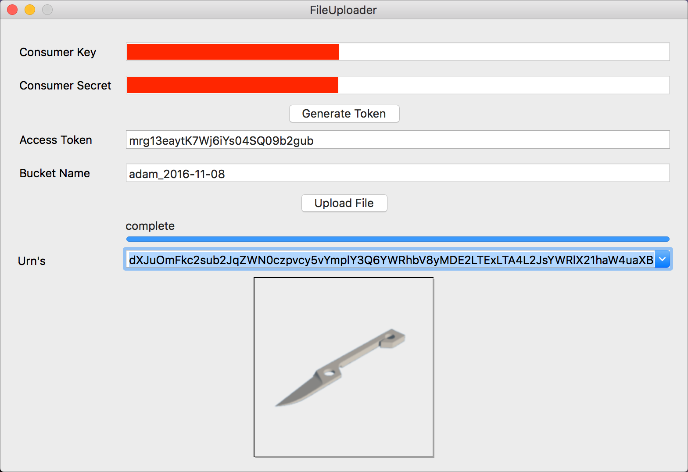

# Swift sample for Forge API's 

## Description

This sample shows how you can use the **Data Management API** to upload files to your application's own private bucket on **OSS**, get it translated using the **Model Derivative API** and then retrieve the generated thumbnail. The front-end will look like this:

**Note:** you can only get simple files translated, i.e. files which reference other files (like an Inventor assembly) will have no geometry in their translated version.

## Dependencies

Needs **XCode 8** and **Swift 3**

## Setup/Usage Instructions
 
* Apply for your own credentials (API keys) from [developer.autodesk.com](http://developer.autodesk.com)
* Fill the form's **Consumer Key** & **Consumer Secret** with your Forge app's credentials
* Click **Generate Token** in order to authenticate with the Forge webservices. This will fill the **Access Token** text field of the form
* Specify a **Bucket Name** you want to use. Note that it needs to be lower case characters and numbers and needs to be globally unique. One easy way to make sure that it will be unique is to use the lower case version of your **Consumer Key** as the first part of the **Bucket Name** and then add something to that
* Click **Upload File** to create the new bucket and upload a file to it. This will also start the translation process and will write information about how far the translation got
* The **Urn's** field will keep a list of all the files that got uploaded to your bucket. Once the translation finished for a specific item then the thumbnail for it will become available. Now when you select an item from the **Urn's** list then the file's thumbnail will appear in the bottom part of the form

## License

That samples are licensed under the terms of the [MIT License](http://opensource.org/licenses/MIT). Please see the [LICENSE](LICENSE) file for full details.

## Written by 

Adam Nagy (Forge Partner Development) 
http://forge.autodesk.com 

